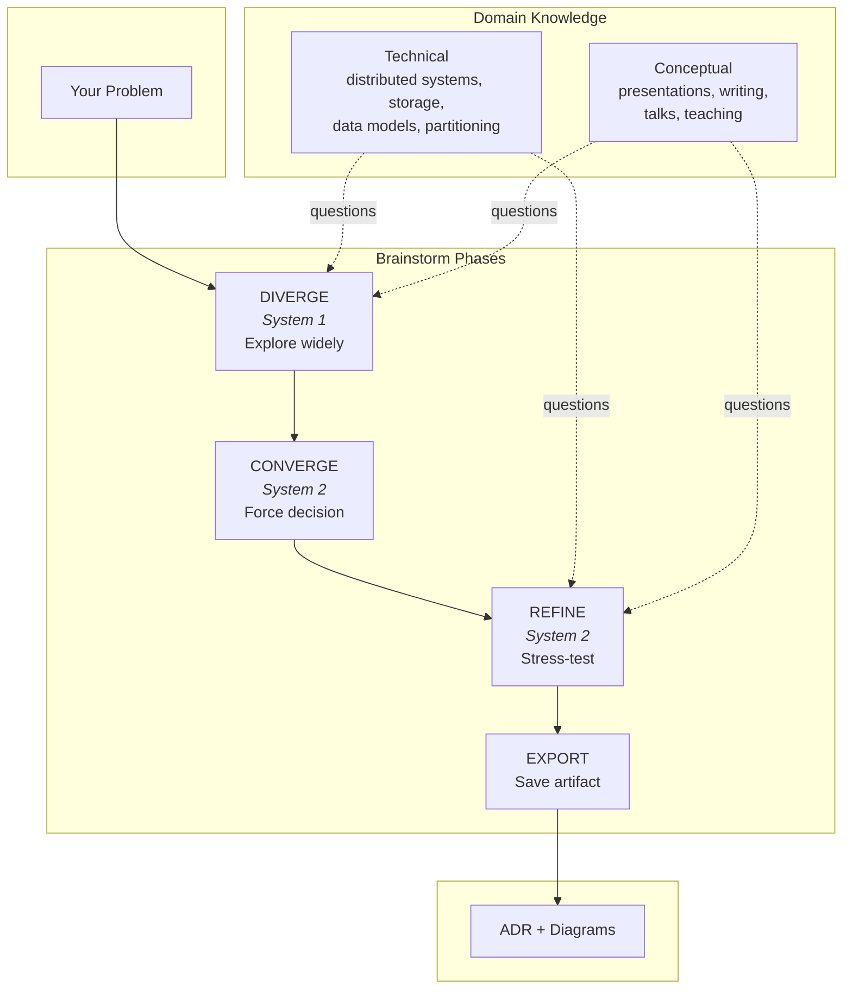
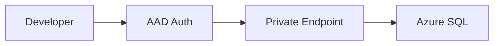

# Arete

*ἀρετή — excellence earned through effort, not given.*

A brainstorming framework for Claude Code that argues back.

## The Problem

You ask. It answers. You ship. Then the system breaks at 3 AM and you realize you never understood why you chose a jumphost over Private Endpoints—you just accepted a suggestion.

Arete asks questions:

```
Arete: "Why a jumphost?"
You:   We need to access the database in the VNet.
Arete: "What are you protecting it from?"
You:   External access. It's got sensitive data.
Arete: "So you're exposing an SSH endpoint to reach your most protected resource?"
You:   It's only accessible from our IP range.
Arete: "Who manages the patching? The key rotation?"
You:   ...I didn't think about that.
```

That pause is the point.

## The Workflow



## Getting Started

```bash
/plugin marketplace add jesgarram/arete
/plugin install arete@jesgarram/arete
```

Start a session:

```bash
/arete:brainstorm "Secure access to a production database in a private VNet"
```

## Output

Sessions become Architecture Decision Records in `context/exports/`:

```yaml
---
problem: "Secure access to production database in private VNet"
decision: "Private Endpoints with AAD authentication, no jumphost"
date: 2025-01-11
---
```

Six months later, search your ADRs. Find every decision about network access patterns. New engineers read *why* things work the way they do.

When you discuss component interactions, Mermaid diagrams generate inline:



## Domains

Arete loads questions matched to your problem.

**Technical** — distributed systems, storage patterns, data models, batch/stream processing, partitioning

**Conceptual** — presentations, technical writing, talks, teaching

Add your own in `skills/diverge/reference/`:

```markdown
# Your Domain

## Key Concepts
The fundamental trade-off in this domain.

## Questions
- Question that reveals hidden assumptions
- Question about failure modes
- Question about scale implications
```

## Why It Works

**[System 1 and System 2](https://en.wikipedia.org/wiki/Thinking,_Fast_and_Slow)**: Fast and slow thinking. Vibe coding traps you in System 1: no friction, just pattern-matching. Spec-driven tools trap you in System 2: ten pages of requirements, zero momentum. You need both. DIVERGE/CONVERGE/REFINE forces the switch.

**[Flow](https://en.wikipedia.org/wiki/Flow_(psychology))**: Challenge slightly exceeds skill. Too easy, you drift. Too hard, you quit. The questions calibrate difficulty.

**[Zone of Proximal Development](https://en.wikipedia.org/wiki/Zone_of_proximal_development)**: The band just past what you can do alone. Close enough to reach, far enough to stretch. Teachers know it. Coaches know it. Most AI tools ignore it. Arete doesn't agree with you—it asks the next question.

## Contributing

1. Fork the repo
2. Create a branch (`git checkout -b my-domain`)
3. Add your changes
4. Open a PR

New domains sharpen the challenge. The more specific the questions, the harder it is to coast.
