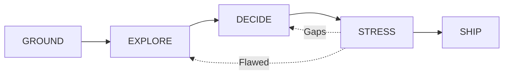

# Arete

ἀρετή — excellence earned through effort, not given.

A structured brainstorming framework for agentic harnesses (e.g. Claude Code, OpenCode CLI, Copilot CLI) that argues back. It forces you to pause, think, and design before you implement.

**Install (for Claude Code):**

```bash
/plugin marketplace add jesgarram/arete
/plugin install arete@jesgarram/arete
```

---

## Quick Start

1. Install the plugin (see above)
2. Run: `/arete:brainstorm "your problem here"`
3. Follow the prompts through GROUND → EXPLORE → DECIDE → STRESS → SHIP

That's it. Arete will guide you through each phase.

---

## What It Does

**You**: "I want to use MongoDB for this project because it's faster to set up."

**Standard AI**: Generates a `docker-compose.yml` and a schema immediately.

**Arete**: "The data model you described is highly relational. If we use a document store here, we'll end up managing complex relationships in application code. Are we choosing this for the data model, or for setup speed?"

Arete asks clarifying questions before you write code—the kind your best tech lead would ask, except it's 2am and they're asleep.

---

## When to Use

| Good fit | Skip it |
|----------|---------|
| Greenfield features | Hotfixes |
| Architecture decisions | Typo fixes |
| "Which database?" questions | "Add a button" tasks |
| Explaining complex topics | Anything under 30 minutes of work |
| Anything you'll regret in 6 months | |

---

## Who This Is For

Engineers who know that code is a liability, not an asset, and who've inherited systems where nobody remembers why decisions were made. Who've sat in postmortems thinking "we knew this would happen."

If you'd rather write 100 lines that solve the problem than 1000 that look impressive, this is for you.

---

## What This Is NOT

Arete won't make decisions for you. It structures the conversation you should be having and asks questions you might skip. The answers—and the judgment—are still yours.

Sometimes you'll need to pause, dig into actual specs, and come back with real numbers.

---

## Commands

| Command | Purpose |
|---------|---------|
| `/arete:brainstorm` | Start a full session with a goal |
| `/arete:research` | Spawn a researcher to explore codebase or web |
---

## How It Works

**Phase-Based Flow**: Each phase has explicit exit criteria. You can't skip GROUND (problem validation) to jump into DECIDE (solution selection). The structure prevents premature commitment.

**Research Spawning**: During any phase, Arete can spawn a researcher agent to validate decisions—either searching your codebase for existing patterns or the web for industry best practices.

**Architect Spawning**: During SHIP, parallel architect agents generate mermaid diagrams (C4 component, sequence, or flowchart) for sections with component interactions.

**Dual-Track Detection**: Automatically identifies whether you're solving a technical problem (architecture, databases, APIs) or a conceptual one (presentations, documentation, persuasion) and adjusts its questions accordingly.

**Structured Output**: Sessions produce cross-referenced ADRs and implementation plans that become context for future decisions.

---

## The Workflow



### Phases

| Phase | Purpose | Exit Criteria |
|-------|---------|---------------|
| **GROUND** | Verify the problem exists and is worth solving | WHY, WHO, and WHAT-IF-NOTHING are clear |
| **EXPLORE** | Generate multiple approaches to avoid tunnel vision | 5+ directions explored |
| **DECIDE** | Select an approach and explicitly accept trade-offs | One path chosen, trade-offs acknowledged |
| **STRESS** | Actively try to break the plan before implementation | No unanswered "what if..." scenarios |
| **SHIP** | Output a verified design document | ADR + Plan saved to workspace |

Each phase can loop back if gaps are found during stress-testing.

### Quality Gates

GROUND has a **kill switch**: if stakes are vague ("it's not ideal", "nothing terrible happens"), Arete asks "The cost of inaction isn't clear. Dig deeper or park this?" This prevents wasting time on non-problems.

Throughout all phases, Arete watches for common anti-patterns:

| Anti-pattern | Challenge |
|--------------|-----------|
| "It's slow" | How slow? For whom? Under what load? |
| "Users want X" | Which users? Did you ask them? |
| "Design for scale" | What's the current scale? What's the target? |
| "Best practice says..." | Best practice for what context? |

---

## Two Tracks

Arete detects whether you're solving a **technical** or **conceptual** problem:

| Technical | Conceptual |
|-----------|------------|
| System design, architecture | Presentations, talks |
| Database choices, APIs | Blog posts, documentation |
| Scale, performance, reliability | Audience, narrative, persuasion |

**Technical example**: "Should I use Kafka or RabbitMQ for event processing?"
→ Questions about throughput, ordering guarantees, operational complexity

**Conceptual example**: "I need to explain our migration to executives"
→ Questions about audience fears, the one thing they must remember, resistance points

---

## Output

After completing a session, Arete produces cross-referenced documents in the `context/` directory:

### Technical Track:

- ADR (`context/exports/`): The decision record (Context, Decision, Consequences).
- Plan (`context/plans/`): The implementation details (Steps, Configuration, Error Handling).

### Conceptual Track:

- Outline (`context/exports/`): A structured outline for your presentation or writing.

## Why It Works

It's hard to argue with yourself when you already have a solution in mind. Arete forces counterarguments into the conversation before you're committed to your first idea.

The design docs compound. Six months from now, when someone asks "why didn't we just use Postgres?"—the answer is written down.

---

## Principles

- **No Solutioneering**: Validate the problem before writing code.
- **Precision over Speed**: "Make it scalable" is a wish. "Handle 10k RPS" is a constraint.
- **Logic before Infrastructure**: Define *why* and *what* before deciding *how* to deploy.

---

## Contributing

- **Found a bug or have an idea?** Open an issue on GitHub.

- **Want to add a domain?** Reference libraries live in `skills/*/reference/`. Add a new `.md` file with domain-specific questions and heuristics.

- **Want to improve a phase?** Each phase is a skill in `skills/`. The `SKILL.md` file defines behavior, exit criteria, and response style.

PRs are more than welcome! Keep changes focused.
