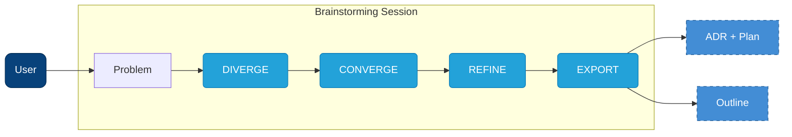
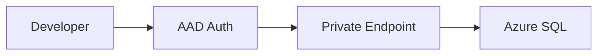
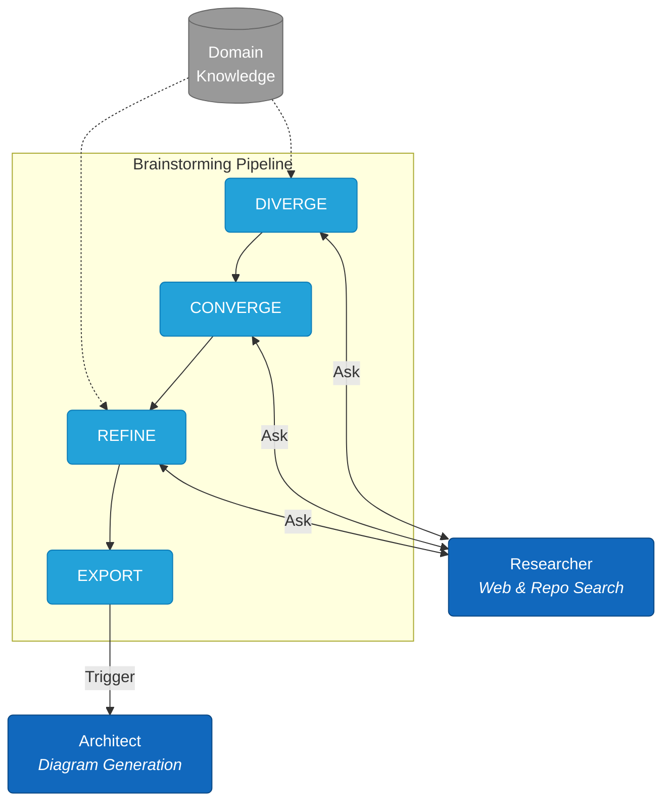

# Arete

*ἀρετή — excellence earned through effort, not given.*

A structured brainstorming framework for Claude Code that argues back. It forces you to pause, think, and design before you implement.

## Table of Contents

- [The Problem](#the-problem)
- [How It Works](#how-it-works)
- [Getting Started](#getting-started)
- [Output](#output)
- [Domains](#domains)
- [Why It Works](#why-it-works)
- [System Architecture](#system-architecture)
- [Contributing](#contributing)

## The Problem

You ask. It answers. You ship. Then the system breaks at 3 AM and you realize you never understood why you chose a jumphost over Private Endpoints—you just accepted a suggestion.

Arete asks questions:

```
Arete: "Why a jumphost?"
You:   We need to access the database in the VNet.
Arete: "What are you protecting it from?"
You:   External access. It's got sensitive data.
Arete: "So you're exposing an SSH endpoint to reach your most protected resource?"
You:   It's only accessible from our IP range.
Arete: "Who manages the patching? The key rotation?"
You:   ...I didn't think about that.
```

That pause is the point.

## How It Works

The core loop is simple: you bring a problem, Arete guides you through three distinct modes of thinking, and you leave with tangible artifacts.



### The Phases

1.  **DIVERGE**: Explore options and challenge assumptions. Arete acts as a critic, asking "Why?" and "What if?" to broaden the scope.
2.  **CONVERGE**: Narrow down the possibilities. You select the most viable approach based on technical constraints and requirements.
3.  **REFINE**: Polish the details. This is where you flesh out the specific implementation steps or narrative structure.
4.  **EXPORT**: Generate the final artifacts (ADR, Plan, or Outline) based on the session context.

## Getting Started

### Installation

Run the following commands inside your Claude Code session:

```bash
/plugin marketplace add jesgarram/arete
/plugin install arete@jesgarram/arete
```

### Usage Example

Start a session with a specific goal:

```bash
/arete:brainstorm "Secure access to a production database in a private VNet"
```

**What to expect:**
1.  **Initialization**: Arete analyzes your request and loads relevant domain knowledge (e.g., *Distributed Systems*, *Security*).
2.  **The Debate**: It will ask clarifying questions about your assumptions (e.g., "Why not use Private Endpoints?").
3.  **The Result**: Once you've navigated the phases, it generates a decision record and an implementation plan.

## Output

Arete generates artifacts based on the session track.

**Technical Track**:
- **ADR** (`context/exports/`): The decision record (Context, Decision, Consequences).
- **Plan** (`context/plans/`): The implementation details (Steps, Configuration, Error Handling).

**Conceptual Track**:
- **Outline** (`context/exports/`): A structured outline for your presentation or writing.

Example ADR:
```yaml
---
problem: "Secure access to production database in private VNet"
decision: "Private Endpoints with AAD authentication, no jumphost"
date: 2025-01-11
plan: "secure-access-plan-2025-01-11.md"
---
```

Six months later, search your ADRs. Find every decision about network access patterns. New engineers read *why* things work the way they do.

When you discuss component interactions, Mermaid diagrams generate inline:



## Domains

Arete loads questions matched to your problem.

**Technical** — distributed systems, storage patterns, data models, batch/stream processing, partitioning

**Conceptual** — presentations, technical writing, talks, teaching

To add your own, you can fork the repository and add markdown files in `skills/diverge/reference/`:

```markdown
# Your Domain

## Key Concepts
The fundamental trade-off in this domain.

## Questions
- Question that reveals hidden assumptions
- Question about failure modes
- Question about scale implications
```

## Why It Works

**[System 1 and System 2](https://en.wikipedia.org/wiki/Thinking,_Fast_and_Slow)**: Fast and slow thinking. Vibe coding traps you in System 1: no friction, just pattern-matching. Spec-driven tools trap you in System 2: ten pages of requirements, zero momentum. You need both. DIVERGE/CONVERGE/REFINE forces the switch.

**[Flow](https://en.wikipedia.org/wiki/Flow_(psychology))**: Challenge slightly exceeds skill. Too easy, you drift. Too hard, you quit. The questions calibrate difficulty.

**[Zone of Proximal Development](https://en.wikipedia.org/wiki/Zone_of_proximal_development)**: The band just past what you can do alone. Close enough to reach, far enough to stretch. Teachers know it. Coaches know it. Most AI tools ignore it. Arete doesn't agree with you—it asks the next question.

## System Architecture

Under the hood, Arete orchestrates specialized sub-agents and domain knowledge to support the session.

**Key Components:**
- **Researcher**: A lateral agent available during any brainstorming phase to fetch context from the web or codebase.
- **Architect**: Triggered during export to convert text descriptions into Mermaid diagrams.
- **Domains**: Injected question sets that challenge assumptions.



## Contributing

1. Fork the repo
2. Create a branch (`git checkout -b my-domain`)
3. Add your changes
4. Open a PR
