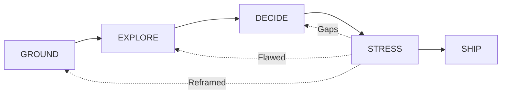

# Arete

ἀρετή — excellence earned through effort, not given.

LLMs are great at writing code. They're terrible at deciding *what* to build.

I kept hitting the same wall. I'd give Claude a vague prompt, and ten seconds later I had a `docker-compose.yml`, a schema, and three new dependencies. No questions asked. I was missing this kind of, you know, annoying senior engineer challenging my decisions. So I was like, I'm going to build one.

That's Arete. A guided brainstorm that forces you to pause, think, and design properly before any code gets written. Five phases, each with exit criteria.

## Two tracks

Arete detects whether you're solving a technical or a conceptual problem and routes the questions accordingly.

| Technical | Conceptual |
|-----------|------------|
| System design, schemas, scale | Talks, blog posts, audience |
| "Should I use Kafka or RabbitMQ?" | "How do I explain this migration to execs?" |

## How it works


```mermaid
flowchart LR
    Ground[GROUND] --> Explore[EXPLORE] --> Decide[DECIDE] --> Stress[STRESS] --> Ship[SHIP]
    Stress -.->|Flawed| Explore
    Stress -.->|Gaps| Decide
    Stress -.->|Reframed| Ground
```

Five phases, each a skill. They run in order. If stress-testing finds gaps, you loop back instead of pushing through.

**Ground.** Make sure the problem is real. Probes the trigger, the pain, who hurts, the cost of inaction, and the user requirements. Refuses vague pain — "it's slow" gets "how slow, for whom, under what load?" There's a kill switch: if the stakes are vague ("it's not ideal"), the conversation stops. The thing is, most "problems" don't survive ground.

**Explore.** Diverge. Surfaces multiple approaches before narrowing. No solutioning yet. One question at a time, building on your keywords. You'd be surprised how often "I already know what I want" doesn't survive three minutes of this.

**Decide.** Converge. Forces a trade-off matrix — effort, risk, reversibility, NFRs. Reversibility is the most undervalued axis in tech decisions, of course, so it's always there. The decision is a provisional bet, not a marriage.

**Stress.** The grind. Pre-mortem ("it's six months from now and this failed — walk me through what went wrong"), challenge every claim from explore and decide, and on the technical track, sharpen rough user requirements into testable acceptance criteria. Trip-wire: an AC is good enough when you could write a `Verify:` command for it. Past that point you're spiralling.

**Ship.** Output the artifacts (see below).

### Skipping phases

If you walk in with prior research and a clear idea, you don't have to start from Ground. Each phase is its own skill — call `/arete:stress` directly and start there. I do this myself when I already have a draft and just need the grind.

But only if you know what you're doing. The exit criteria exist because most "problems" don't survive Ground. Skip the phases that already cleared their criteria in your head. Don't skip the ones that didn't.

## Output

On the technical track, three artifacts that cross-reference each other:

| Artifact | Lives in | Answers |
|----------|----------|---------|
| ADR | `context/designs/` | *Why and what* |
| Spec | `context/specs/` | *What's true when done* (User Requirements, Acceptance Criteria, NFRs) |
| Plan | `context/plans/` | *How* — tasks with `Satisfies: AC-N` linking back to the Spec |

The asymmetric coverage rule: every AC in the Spec must be referenced by at least one Plan task whose `Verify:` is an executable command. Tasks without `Satisfies:` are allowed — scaffolding, refactors, observability. The reverse direction is intentionally not enforced. The point is to make AC IDs carriers of testability, not theater.

On the conceptual track, Ship produces an outline instead. No AC machinery — outlines don't need it.

## Subagents

Three agents run quietly in parallel without blocking the main brainstorm:

- **Researcher** — looks things up. Repository or web. Triggered by "how do others do this?"
- **Teacher** — explains a concept properly without polluting context. Drops a 5-section doc in `context/teachings/`. Triggered by "teach me about X."
- **Architect** — draws mermaid diagrams from sections describing components, services, flows. Triggered automatically at Ship.

## Install

```bash
# Claude Code
/plugin marketplace add jesgarram/arete
/plugin install arete@jesgarram/arete
```

Then:

```
/arete:brainstorm "I want to refactor our auth service"
```

Follow the questions. Don't fight them.

For OpenCode, Copilot, or Codex, see the per-platform install files in [`.opencode/`](.opencode/INSTALL.md), [`.github/`](.github/INSTALL.md), and [`.codex/`](.codex/INSTALL.md). Codex doesn't support subagents, so you get skills only.

## When to skip it

| Use Arete | Skip it |
|-----------|---------|
| Anything you'll regret in 6 months | Hotfixes |
| Architecture decisions, greenfield features | Typo fixes, "add a button" |
| "Which database?" questions | Anything under 30 minutes of work |

For problems with multiple independent dimensions ("redesign auth AND migrate the DB AND change the API"), Arete decomposes them into focused sub-sessions instead of trying to brainstorm everything at once.

## Contributing

Found a bug or have an idea? Open an issue.

The structure is simple:

- Each phase is a skill in `skills/`. The `SKILL.md` defines behavior, exit criteria, and response style.
- Domain references live in `skills/*/references/`. Add a new `.md` file with domain-specific questions and you've extended the system.
- Agents have a canonical version in `agents/` — edit there, then run `./scripts/generate-agents.sh` to propagate.

PRs more than welcome. Keep changes focused.
